* Table of Contents
{:toc}

--------------------------------------------------------------------------------------------------------------------

## **Acknowledgements**

* The **CS2103T teaching team** for providing us with the [base project](https://github.com/nus-cs2103-AY2324S2/tp) that Teachstack builds upon, as well as for their invaluable guidance throughout this project's development. 
* **Any other libaries or 3rd-party code**  already used in the [base project](https://github.com/nus-cs2103-AY2324S2/tp). (see link for details)  

* The idea for **clickable email** was inspired from a similar feature in project [CodeConnect](https://github.com/AY2324S2-CS2103T-T12-1/tp). 
--------------------------------------------------------------------------------------------------------------------

## **Setting up, getting started**

Refer to the guide [_Setting up and getting started_](SettingUp.md).

--------------------------------------------------------------------------------------------------------------------

## **Design**

:bulb: **Tip:** The `.puml` files used to create diagrams in this document `docs/diagrams` folder. Refer to the [_PlantUML Tutorial_ at se-edu/guides](https://se-education.org/guides/tutorials/plantUml.html) to learn how to create and edit diagrams.

### Architecture

The ***Architecture Diagram*** given above explains the high-level design of the App.

Given below is a quick overview of main components and how they interact with each other.

**Main components of the architecture**

**`Main`** (consisting of classes [`Main`](https://github.com/se-edu/addressbook-level3/tree/master/src/main/java/seedu/address/Main.java) and [`MainApp`](https://github.com/se-edu/addressbook-level3/tree/master/src/main/java/seedu/address/MainApp.java)) is in charge of the app launch and shut down.
* At app launch, it initializes the other components in the correct sequence, and connects them up with each other.
* At shut down, it shuts down the other components and invokes cleanup methods where necessary.

The bulk of the app's work is done by the following four components:

* [**`UI`**](#ui-component): The UI of the App.
* [**`Logic`**](#logic-component): The command executor.
* [**`Model`**](#model-component): Holds the data of the App in memory.
* [**`Storage`**](#storage-component): Reads data from, and writes data to, the hard disk.

[**`Commons`**](#common-classes) represents a collection of classes used by multiple other components.

**How the architecture components interact with each other**

The *Sequence Diagram* below shows how the components interact with each other for the scenario where the user issues the command `view A0123456X`.

Each of the four main components (also shown in the diagram above),

* defines its *API* in an `interface` with the same name as the Component.
* implements its functionality using a concrete `{Component Name}Manager` class (which follows the corresponding API `interface` mentioned in the previous point.

For example, the `Logic` component defines its API in the `Logic.java` interface and implements its functionality using the `LogicManager.java` class which follows the `Logic` interface. Other components interact with a given component through its interface rather than the concrete class (reason: to prevent outside component's being coupled to the implementation of a component), as illustrated in the (partial) class diagram below.

The sections below give more details of each component.

### UI component

The **API** of this component is specified in [`Ui.java`](https://github.com/se-edu/addressbook-level3/tree/master/src/main/java/seedu/address/ui/Ui.java)

The UI consists of a `MainWindow` that is made up of parts e.g.`CommandBox`, `ResultDisplay`, `PersonListPanel`, `StatusBarFooter` etc. All these, including the `MainWindow`, inherit from the abstract `UiPart` class which captures the commonalities between classes that represent parts of the visible GUI.

The `UI` component uses the JavaFx UI framework. The layout of these UI parts are defined in matching `.fxml` files that are in the `src/main/resources/view` folder. For example, the layout of the [`MainWindow`](https://github.com/se-edu/addressbook-level3/tree/master/src/main/java/seedu/address/ui/MainWindow.java) is specified in [`MainWindow.fxml`](https://github.com/se-edu/addressbook-level3/tree/master/src/main/resources/view/MainWindow.fxml)

The `UI` component,

* executes user commands using the `Logic` component.
* listens for changes to `Model` data so that the UI can be updated with the modified data.
* keeps a reference to the `Logic` component, because the `UI` relies on the `Logic` to execute commands.
* depends on some classes in the `Model` component, as it displays `Person` object residing in the `Model`.

### Logic component

**API** : [`Logic.java`](https://github.com/se-edu/addressbook-level3/tree/master/src/main/java/seedu/address/logic/Logic.java)

Here's a (partial) class diagram of the `Logic` component:

The sequence diagram below illustrates the interactions within the `Logic` component, taking `execute("delete A0123456X")` API call as an example.

:information_source: **Note:** The lifeline for `DeleteCommandParser` should end at the destroy marker (X) but due to a limitation of PlantUML, the lifeline continues till the end of diagram.

How the `Logic` component works:

1. When `Logic` is called upon to execute a command, it is passed to an `AddressBookParser` object which in turn creates a parser that matches the command (e.g., `DeleteCommandParser`) and uses it to parse the command.
1. This results in a `Command` object (more precisely, an object of one of its subclasses e.g., `DeleteCommand`) which is executed by the `LogicManager`.
1. The command can communicate with the `Model` when it is executed (e.g. to delete a person). 
   Note that although this is shown as a single step in the diagram above (for simplicity), in the code it can take several interactions (between the command object and the `Model`) to achieve.
1. The result of the command execution is encapsulated as a `CommandResult` object which is returned back from `Logic`.

Here are the other classes in `Logic` (omitted from the class diagram above) that are used for parsing a user command:

How the parsing works:
* When called upon to parse a user command, the `AddressBookParser` class creates an `XYZCommandParser` (`XYZ` is a placeholder for the specific command name e.g., `AddCommandParser`) which uses the other classes shown above to parse the user command and create a `XYZCommand` object (e.g., `AddCommand`) which the `AddressBookParser` returns back as a `Command` object.
* All `XYZCommandParser` classes (e.g., `AddCommandParser`, `DeleteCommandParser`, ...) inherit from the `Parser` interface so that they can be treated similarly where possible e.g, during testing.

### Model component
**API** : [`Model.java`](https://github.com/se-edu/addressbook-level3/tree/master/src/main/java/seedu/address/model/Model.java)

The `Model` component,

* stores the address book data i.e., all `Person` objects (which are contained in a `UniquePersonList` object).
* stores the currently 'selected' `Person` objects (e.g., results of a search query) as a separate _filtered_ list which is exposed to outsiders as an unmodifiable `ObservableList<Person>` that can be 'observed' e.g. the UI can be bound to this list so that the UI automatically updates when the data in the list change.
* stores a `UserPref` object that represents the user’s preferences. This is exposed to the outside as a `ReadOnlyUserPref` objects.
* does not depend on any of the other three components (as the `Model` represents data entities of the domain, they should make sense on their own without depending on other components)

:information_source: **Note:** An alternative (arguably, a more OOP) model is given below. It has a `Tag` list in the `AddressBook`, which `Person` references. This allows `AddressBook` to only require one `Tag` object per unique tag, instead of each `Person` needing their own `Tag` objects. 

### Storage component

**API** : [`Storage.java`](https://github.com/se-edu/addressbook-level3/tree/master/src/main/java/seedu/address/storage/Storage.java)

The `Storage` component,
* can save both address book data and user preference data in JSON format, and read them back into corresponding objects.
* inherits from both `AddressBookStorage` and `UserPrefStorage`, which means it can be treated as either one (if only the functionality of only one is needed).
* depends on some classes in the `Model` component (because the `Storage` component's job is to save/retrieve objects that belong to the `Model`)

### Common classes

Classes used by multiple components are in the `seedu.addressbook.commons` package.

--------------------------------------------------------------------------------------------------------------------

## **Implementation**

This section describes some noteworthy details on how certain features are implemented.

### Group feature

#### Implementation

The group feature is a modification of the original "tag" feature, where each person can have multiple tags with various sorts of information.
We have adapted the tags for the express purpose of putting students into groups.

The command, like all others, implements `execute`. If possible, all students will be put into the specified group.
A valid student needs to have a `studentId` which fulfils various criteria as specified in the `StudentId` class.
A valid student should also be in the list of current students. **If any students are invalid, the whole command fails.**
Students who are not in the list of existing students are given in the exception message of `GroupCommand` itself.

Internally, the command makes use of the pre-existing `EditCommand#execute(StudentId, editPersonDescriptor)` method.
It calls this method for all given students in a loop.

It is also possible to give no argument for `groups`.
In which case, the students given will have their groups set to none (i.e., removed).

**Here is an example usage scenario:**

Step 1. The user enters command `group gp/3 id/A0123456X id/A0000000H` where
`id/A0123456X` is in the list of existing students, but `id/A0000000H` is not.

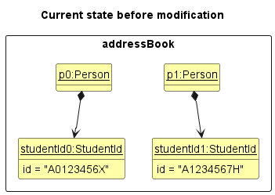

In this case, `id/A0123456X` is not in the list of existing students, so the whole command fails.

Step 2. The user then enters command `group gp/3 id/A0123456X`.
The `group` command calls `EditCommand#execute(StudentId, editPersonDescriptor)` for `id/A0123456X`.
Hence, the student is added to group 3.

Step 3. The user then enters command `group gp/7 id/A0123456X id/A1234567H`.
Since both students are in the list, they are both added to group 7.
Note that `p0` still retains the original group, group 3.

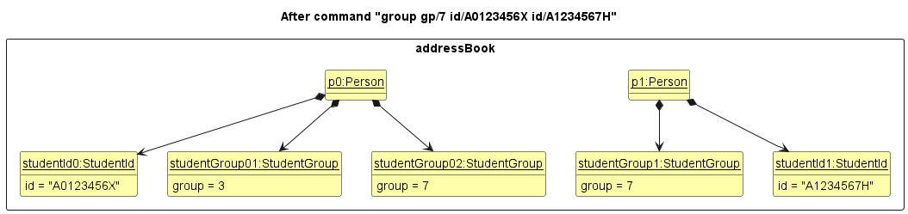

#### Design considerations:

**Aspect: To allow partial success of command or not?
(i.e. successfully add some students even if only some provided IDs are valid)**

* **Alternative 1 (current choice):** Disallow partial success.
    * Pros: Leads to less confusion regarding whether students are successfully added to a group or not (either they all are, or they all aren't.)
    * Is the standard expectation of a CLI command.
    * Cons: Will have to retype command if it fails.

* **Alternative 2:** Allow partial success.
    * Pros and cons are the opposite of those of alternative 1.

### Add Feature

#### Implementation

The add feature is similar to the add feature in AB3, which allows users to add students' details into the list.
However, in our implementation, we decided to extend the add feature to add students' details such as, `name`, `student_id`, `email`, `grade`, `group`
that tailored to our target audience.

Given below is an example usage scenario of `add` feature:

Step 1. Assume the user has some existing students in the `UniquePersonList`.
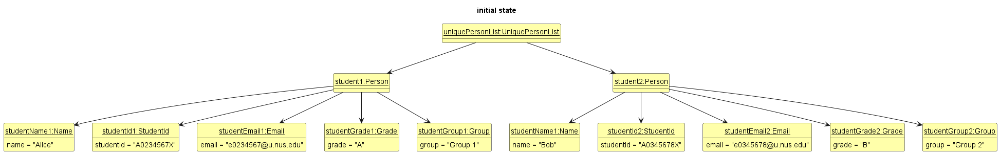

Step 2. The user executes `add id/A0123456X n/John e/e0123456@u.nus.edu g/A` command to add the student into the list.
* The `add` command invokes `LogicManager#execute()`.
* `LogicManager#execute()` would first invoke `AddressBookParser#parseCommand()`.
* `AddressBookParser#parseCommand()` will identifies the `add` command and then invokes `AddCommandParser#parse()` to parse the arguments accordingly.
* `AddCommandParser#parse()` will return a `AddCommand` object which takes in a `Person` object.
* `LogicManager#execute()` invokes `AddCommand#execute()`. Then, `model#addPerson` is called to add the person into the list.
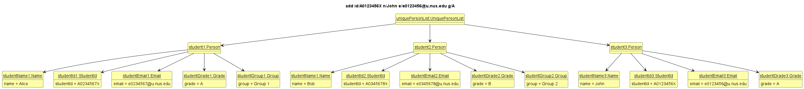

Given below is the sequence diagram for `add` command:

#### Design Considerations

**Aspect: Whether to restrict to the context of NUS**
* **Alternative 1 (current choice):** The `student_id` and `email` must be in the format of `A0123456X` and `e0123456@u.nus.edu`.
  * Pros: Aligns with the target users who are CS instructors in NUS.
  * Cons: Restrictive to users who are not instructors in NUS.

* **Alternative 2:** Allow any other format for `student_id` and valid format for `email`.
  * Pros: Can accommodate users from other universities, not only NUS.
  * Cons: Validation may be more complex as need to account for a wider range of possible inputs.

### Delete feature

#### Implementation

The delete feature is adapted from the delete feature of `AddressBook`. Instead of identifying a student by the index displayed, it uses the `StudentId` that is unique to each student. Calling `DeleteCommand#execute(model)` will delete any student that is in the `UniquePersonList` that is not necessarily in but not in `FilteredList` to be deleted.

Given below is an example usage scenario and how the delete mechanism behaves at each step.

Step 1. The user has added some students to `UniquePersonList`.

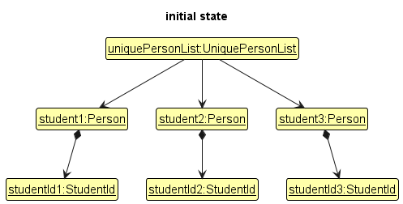

Step 2. The user executes `find` command where only `student1` and `student2` matches the predicate so only `student1` and `student2` are in the `FilteredList` of `ModelManager`.

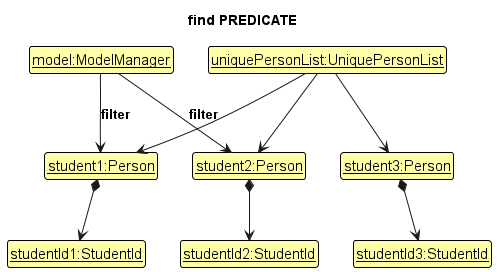

Step 3. The user executes `delete A0123456A` command to delete student with student ID `A0123456A`. `ModelManager#getPerson(StudentId)` returns `student3` which the id belongs to. `student3` will be removed from `UniquePersonList`

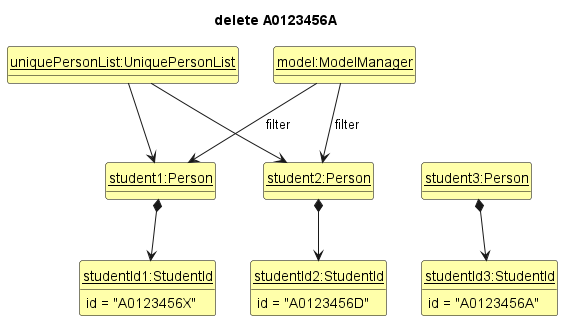

:information_source: **Note:** If `ModelManager#getPerson(StudentId)` returns 0, then there no `Person` having the `studentId`. `DeleteCommand#execute(model)` will check if this is the case. If so, it will return an error to the user rather
than attempting to perform the deletion.

The following sequence diagram shows how a delete operation goes through the `Logic` component:

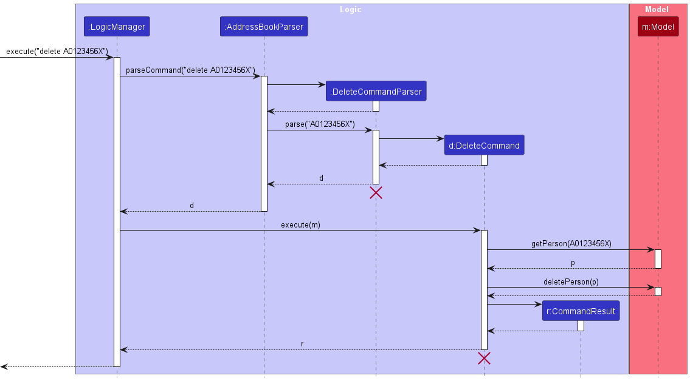

:information_source: **Note:** The lifeline for `DeleteCommandParser` and `DeleteCommand` should end at the destroy marker (X) but due to a limitation of PlantUML, the lifeline reaches the end of diagram.

The following activity diagram summarizes what happens when a user executes a delete command:

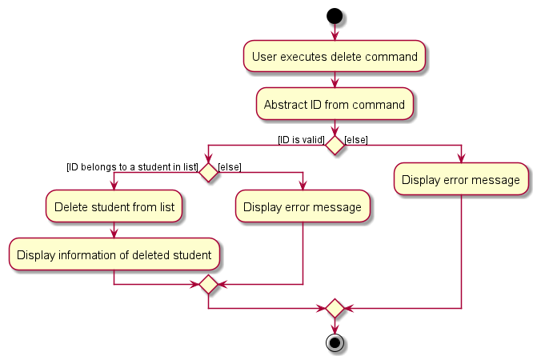

#### Design considerations:

**Aspect: Allow deletion of all `Person` added or only those displayed:**

* **Alternative 1 (current choice):** Can delete any person in the list.
    * Pros: Delete command will execute successfully without having to run additional command to ensure that the person to be deleted is being displayed.
    * Cons: May result in accidental deletion if wrong student id is given.

* **Alternative 2:** Only delete person that is displayed.
    * Pros: Allow user to refer to the displayed data to reduce risk of specifying a wrong id belonging to another person.
    * Cons: May reduce usability as user may have to enter additional command to ensure the student to be deleted is displayed.

**Aspect: Deleted `Person` stored or ready for garbage collection:**

* **Alternative 1 (current choice):** Person deleted is no longer used and ready for garbage collection.
    * Pros: Easy to implement.
    * Cons: May result in lost of data upon accidental deletion.

* **Alternative 2:** Create a list to store all deleted person.
    * Pros: Easier to implement command to recover a deleted person in the future.
    * Cons: Stored deleted person may never be used. May have performance issue in terms of memory usage.

### Find feature

#### Implementation

Our find feature is a rework of the one found in AB3, which allowed users to find persons with names containing specified keywords. Since we now have a stronger method of identifying students (their unique student IDs), we decided to update the feature to find and list students by their membership in groups instead.

A `FindCommand` instance has its own `PersonInGroupPredicate`, which contains a `Set<Group>` and is used to test if a `Person` is in the `Group`s in the set. These groups are specified as arguments when entering the find command. It is also important to note that the `Person` must be in all the `Group`s in the set in order to pass the predicate.

When `FindCommand#execute(model)` is called, `ModelManager#updateFilteredPersonList(predicate)` is invoked to update the filter of the currently shown FilteredList` to match the predicate. To illustrate further, here is a step-by-step breakdown of what happens:

Step 1. The user launches the application. The initial list shown is simply the `UniquePersonList`.

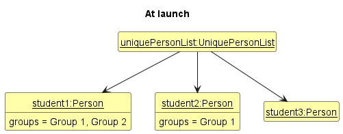

Step 2. The user executes `find gp/Group 1 gp/ Group 2` to find all students that are in both Groups 1 and 2. Only `student1` is in both groups, so after `ModelManager#updateFilteredPersonList(predicate)` is called, only `student1` will be in the `FilteredList`.

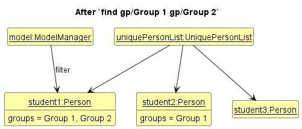

Here is the sequence diagram which shows the overall flow:

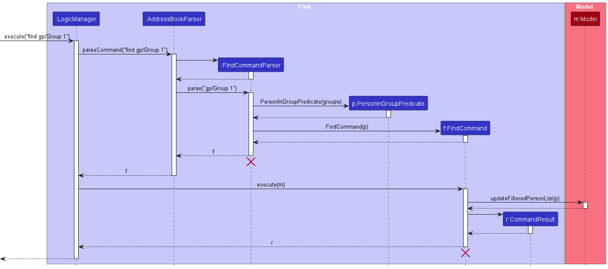

**Aspect: Which model attribute to use for find:**

* **Alternative 1 (current choice):** Filter by `Group`
    * Pros: `Group` names are easy to remember, especially since they are assigned by the user.
    * Cons: Some students may not have a `Group` assigned and can only be found by manually looking through all entries in `UniquePersonList`.

* **Alternative 2:** Filter by `StudentId`
    * Pros: Any student can be found as long as their `StudentId` is known.
    * Cons: It is not practical for users to remember the `StudentId` of each student.

### Random feature

#### Implementation

The random feature is an extension of the group feature. It creates a `GroupCommand` object to form groups, by passing a random set of `studentIds` and `group` of size 1 to the constructor.

When `RandomCommand#execute(model)` is called, it will filter `UniquePersonList` in `Model` to get a `List<Person>` of students where each student matches the predicate `person.isWeak()`. The randomness is achieved using `Collections#shuffle(List<Person>)`, to randomly reorder the `List<Person>`. Note that the result is approximately random where probability of getting each permutation of the list is approximately equal.

Given below is an example usage scenario and how the random grouping mechanism behaves at each step.

Step 1. The user launches the application for the first time. The `Grade#thresholdGrade.value` is set to `C+`. There are some students in the `UniquePersonList`.

Step 2. The user executes `random 2 gp/Random Group` to put all students having `Grade#value` below or equals to `C+` into 2 groups namely `Random Group 1` and `Random Group 2`.

:information_source: **Note:** If `ModelManager#getWeak()` returns `List<Person>` of size less than or equals to the positive integer given in command, the `RandomCommand#execute(model)` will throw a `CommandException`.

:information_source: **Note:** The `Group` objects created will always be the same when the same command is given and the `UniquePersonList` is the same Step 1. However, the association between `Person` and `Grade` objects may be different each time due to the randomness.

The following sequence diagram shows how a random command goes through the `Logic` component:

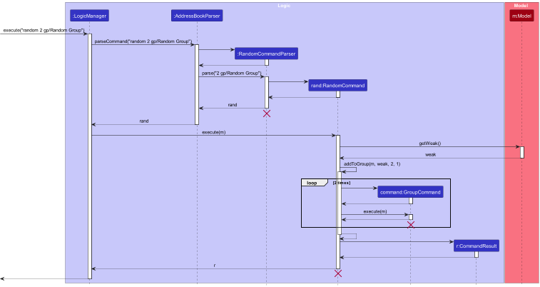

:information_source: **Note:** The lifeline for `RandomCommandParser` and `RandomCommand` should end at the destroy marker (X) but due to a limitation of PlantUML, the lifeline reaches the end of diagram.

The following activity diagram summarizes what happens when a user executes a random command:

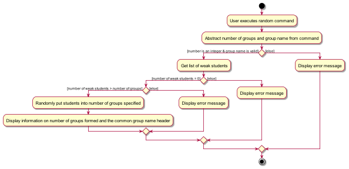

#### Design considerations:

**Aspect: Allow forming groups if number of weak students is equals to the group number specified:**

* **Alternative 1 (current choice):** Random command will not form any group.
    * Pros: Command will not result in groups containing only one student since it will not actually group any student and is not very helpful.
    * Cons: May restrict the use case where user wants to have focus session with weak students individually.

* **Alternative 2:** Random command will form groups.
    * Pros: Allow forming of groups with only one student, less likely to trigger an error message.
    * Cons: May reduce usability as user may not get an actual group of multiple students as expected.

**Aspect: Clear `Group` formed using the `RandomCommand` when `thresholdGrade` is updated and `Grade` of the `Person` is no longer below or at the threshold :**

* **Alternative 1 (current choice):** Random groups formed will not be affected by any change in threshold.
    * Pros: Easy to implement. Random groups formed may still be active and needed for record.
    * Cons: User has to rerun the `random` command to form groups for the updated weak students.

* **Alternative 2:** Remove `Person` from random groups formed if `Grade` of the `Person` is no longer below or at the threshold.
    * Pros: User can use the same groupings for weak students who still require more focus on.
    * Cons: More complicated to implement and record of previous random groupings a `Person` belongs to will be gone. 

### Archive feature

#### Implementation

The archive feature allows the users to keep a record of past students' details.

Given below is an example usage scenario of `archive` feature:

Step 1. Assume the user has some existing students in the `UniquePersonList` of person list.
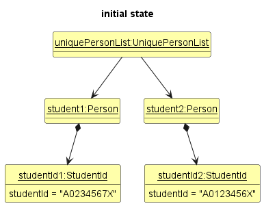

Step 2. The user executes `archive A0123456X` to archive the student into the archived list.
* The `archive` command invokes `LogicManager#execute()`.
* `LogicManager#execute` would first invoke `AddressBookParser#parseCommand()`.
* `AddressBookParser#parseCommand()` will identifies the `archive` command and then invokes `ArchiveCommandParser#parse()` to parse the arguments accordingly.
* `ArchiveCommandParser#parse()` will return a `ArchiveCommand` object which takes in a `StudentId` object.
* `LogicManager#execute()` invokes `ArchiveCommand#execute()`. Then, `model#archivePerson` is called to archive the person into the archived list.
* The archived person will now be added into `UniquePersonList` of the archived list.
* The archived person will also be removed from the `UniquePersonList` of the person list.
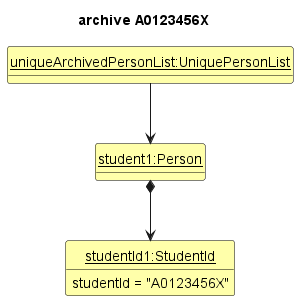

Given below is the sequence diagram for `archive` command:
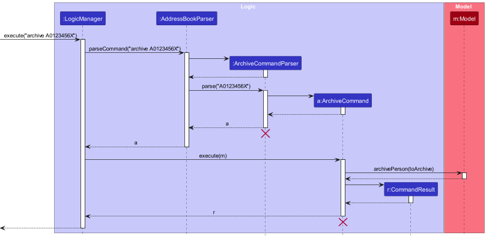

#### Design Considerations

**Aspect: Mass archiving.**
* **Alternative 1 (current choice):** Allow archiving only one student at a time.
    * Pros: Reduce the complexity of archiving process for the users.
    * Cons: May be time-consuming for users who need to archive multiple students.

* **Alternative 2:** Allow users to select and archive multiple students at once.
    * Pros: Increases efficiency by allowing users to archive multiple students simultaneously.
    * Cons: May increase the risk of unintentional archiving.

### Unarchived feature

#### Implementation

The unarchived feature allows the users to unarchive past students' details.

Given below is an example usage scenario of `unarchived` feature:

Step 1. Assume the user has some existing students in the `UniquePersonList` of archived list.
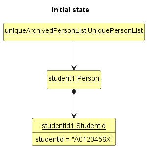

Step 2. The user executes `unarchived A0123456X` to unarchive the student into the person list.
* The `unarchive` command invokes `LogicManager#execute()`.
* `LogicManager#execute` would first invoke `ArchivedBookParser#parseCommand()`.
* `ArchivedBookParser#parseCommand()` will identifies the `unarchived` command and then invokes `UnarchiveCommandParser#parse()` to parse the arguments accordingly.
* `UnarchiveCommandParser#parse()` will return a `UnarchiveCommand` object which takes in a `StudentId` object.
* `LogicManager#execute()` invokes `UnarchiveCommand#execute()`. Then, `model#unarchivePerson` is called to unarchive the archived person into the person list.
* The archived person will now be added into `UniquePersonList` of the person list.
* The archived person will also be removed from the `UniquePersonList` of the archived list.

Given below is the sequence diagram for `unarchived` command:
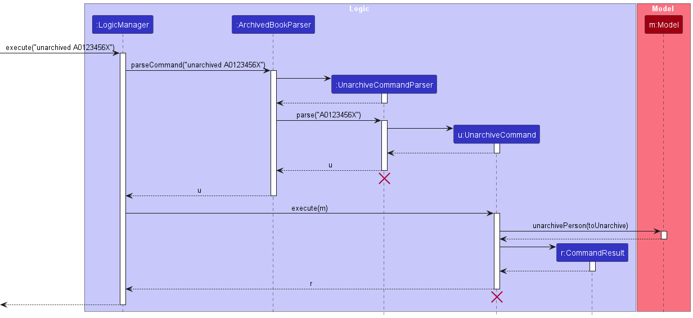

#### Design Considerations

**Aspect: Mass unarchiving.**
* **Alternative 1 (current choice):** Allow unarchiving only one student at a time.
    * Pros: Reduce the complexity of unarchiving process for the users.
    * Cons: May be time-consuming for users who need to unarchive multiple students.

* **Alternative 2:** Allow users to select and unarchive multiple students at once.
    * Pros: Increases efficiency by allowing users to unarchive multiple students simultaneously.
    * Cons: May increase the risk of unintentional unarchiving.

### Edit_Archived feature

#### Implementation

The edit_archived feature is similar to the edit feature. However, edit_archived is only applicable to edit persons in the archived list.

Given below is an example usage scenario of `edit_archived` feature:

Step 1. Assume the user has some existing students in the `UniquePersonList` of archived list.
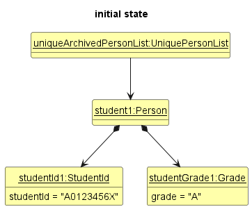

Step 2. The user executes `edit_archived A0123456X g/B` to edit the student's grade to 'B' in the archived list.
* The `edit_archived` command invokes `LogicManager#execute()`.
* `LogicManager#execute` would first invoke `ArchivedBookParser#parseCommand()`.
* `ArchivedBookParser#parseCommand()` will identifies the `edit_archived` command and then invokes `EditArchiveCommandParser#parse()` to parse the arguments accordingly.
  * `EditArchiveCommandParser#parse()` will return a `EditArchiveCommand` object which takes in a `StudentId` object and `EditPersonDescriptor` object.
* `LogicManager#execute()` invokes `EditArchiveCommand#execute()`. Then, `model#setArchivedPerson` is called to replace the `personToEdit` with the `editedPerson`.
* Lastly, the `model#updateFilteredArchivedList()` is called to update the archived list with the editedPerson.
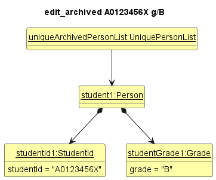

Given below is the sequence diagram for `edit_archived` command:
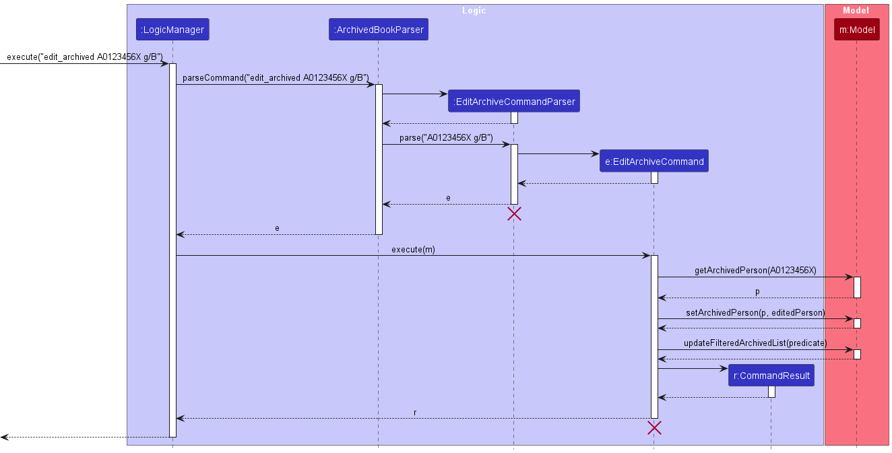

### Delete_Archived feature

#### Implementation

The delete_archived feature is similar to the delete feature. However, delete_archived is only applicable to delete persons in the archived list.

Given below is an example usage scenario of `delete_archived` feature:

Step 1. The user has added some students to `UniquePersonList` of the archived list.

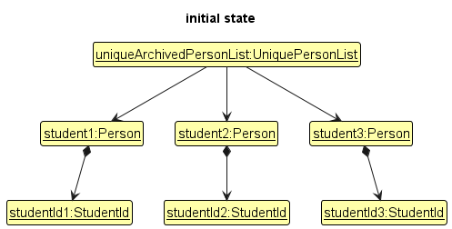

Step 2. The user executes `find` command where only `student1` and `student2` matches the predicate so only `student1` and `student2` are in the `FilteredArchivedList` of `ModelManager`.

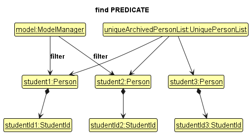

Step 3. The user executes `delete_archived A0123456A` command to delete student with student ID `A0123456A`. `ModelManager#getArchivedPerson(StudentId)` returns `student3` which the id belongs to. `student3` will be removed from `UniquePersonList` of the archived list.

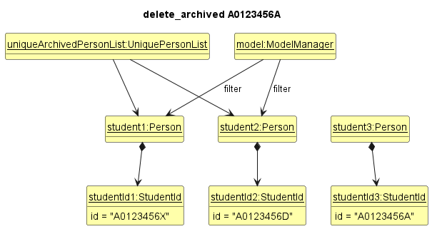

Given below is the sequence diagram for `delete_archived` command:
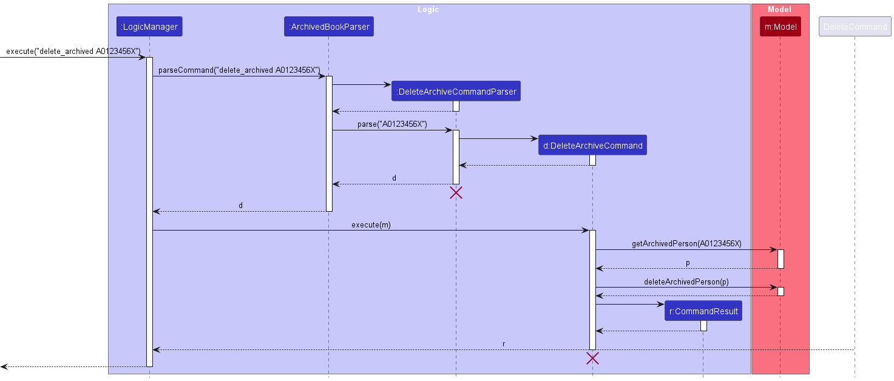

--------------------------------------------------------------------------------------------------------------------
### Set Weakness Threshold Feature

This is a new command to designate students as being "weak" or not based on their grades. `thresholdGrade` is a value 
within `Grade`. This does not affect students who have been archived. 

By default, we have set C+ as the `thresholdGrade`, meaning that a student with grade lower than or equal to C+ is
displayed with a weak marker next to their name (as shown below).

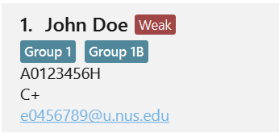

The command `set weak g/GRADE` followed by the grade parameter allows the instructor to set a different grade as the
new `thresholdGrade`. This command resets students' weak markers and updates the display immediately.

The below sequence diagram displays the interactions while executing the command: `setweak g/B`

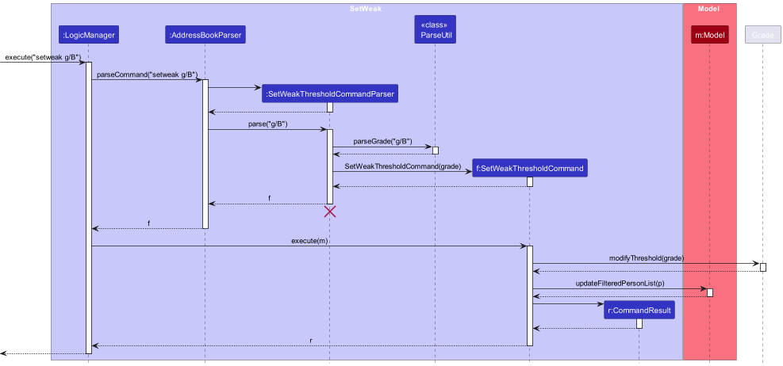

--------------------------------------------------------------------------------------------------------------------

### Summary Statistics Feature

This is a new command to view summary statistics of all students.
Entering the command `summary` results in a popup window in the gui. The popup window consists of summary data including total
number of students, mean grade, and standard deviation of grades. Additionally, a colored pie chart is displayed of the
students' grade distribution.

Implementation:
The `summary` command is implemented as such: 

- `LogicManager`'s execute method calls the `parseCommand` method from `AddressBookParser`
- `parseCommand` creates a `SummaryCommand`
- `SummaryCommand`'s execute method is called by `LogicManager`.
- `SummaryCommand` computes the total number of students, mean grade, and standard deviation of grade. It also generates 
a pie chart of grades.
- `SummaryCommand` creates and passes a `CommandResult` object to `LogicManager`
- `LogicManager` passes `CommandResult` to `UI` to display `Person` list with the summary. 

Currently, if the `summary` command is used with 0 students, the popup window shows total number of students = 0, mean grade is blank,
and standard deviation as 0. And no pie chart is displayed.

Unlike other commands, the `summary` command does not have a `SummaryCommandParser`. This is because this command does not take in any input. 

Proposed:  
Modifying the summary command to include an input, thereby allowing the user to also view summary of a group.

---------------------------------------------------------------------------------------------------------------------
### \[Proposed\] Undo/redo feature

#### Proposed Implementation

The proposed undo/redo mechanism is facilitated by `VersionedAddressBook`. It extends `AddressBook` with an undo/redo history, stored internally as an `addressBookStateList` and `currentStatePointer`. Additionally, it implements the following operations:
* `VersionedAddressBook#commit()` — Saves the current address book state in its history.
* `VersionedAddressBook#undo()` — Restores the previous address book state from its history.
* `VersionedAddressBook#redo()` — Restores a previously undone address book state from its history.

These operations are exposed in the `Model` interface as `Model#commitAddressBook()`, `Model#undoAddressBook()` and `Model#redoAddressBook()` respectively.

Given below is an example usage scenario and how the undo/redo mechanism behaves at each step.

Step 1. The user launches the application for the first time. The `VersionedAddressBook` will be initialized with the initial address book state, and the `currentStatePointer` pointing to that single address book state.

Step 2. The user executes `delete 5` command to delete the 5th person in the address book. The `delete` command calls `Model#commitAddressBook()`, causing the modified state of the address book after the `delete 5` command executes to be saved in the `addressBookStateList`, and the `currentStatePointer` is shifted to the newly inserted address book state.

Step 3. The user executes `add n/David …​` to add a new person. The `add` command also calls `Model#commitAddressBook()`, causing another modified address book state to be saved into the `addressBookStateList`.

:information_source: **Note:** If a command fails its execution, it will not call `Model#commitAddressBook()`, so the address book state will not be saved into the `addressBookStateList`.

Step 4. The user now decides that adding the person was a mistake, and decides to undo that action by executing the `undo` command. The `undo` command will call `Model#undoAddressBook()`, which will shift the `currentStatePointer` once to the left, pointing it to the previous address book state, and restores the address book to that state.

:information_source: **Note:** If the `currentStatePointer` is at index 0, pointing to the initial AddressBook state, then there are no previous AddressBook states to restore. The `undo` command uses `Model#canUndoAddressBook()` to check if this is the case. If so, it will return an error to the user rather
than attempting to perform the undo.

The following sequence diagram shows how an undo operation goes through the `Logic` component:

:information_source: **Note:** The lifeline for `UndoCommand` should end at the destroy marker (X) but due to a limitation of PlantUML, the lifeline reaches the end of diagram.

Similarly, how an undo operation goes through the `Model` component is shown below:

The `redo` command does the opposite — it calls `Model#redoAddressBook()`, which shifts the `currentStatePointer` once to the right, pointing to the previously undone state, and restores the address book to that state.

:information_source: **Note:** If the `currentStatePointer` is at index `addressBookStateList.size() - 1`, pointing to the latest address book state, then there are no undone AddressBook states to restore. The `redo` command uses `Model#canRedoAddressBook()` to check if this is the case. If so, it will return an error to the user rather than attempting to perform the redo.

Step 5. The user then decides to execute the command `list`. Commands that do not modify the address book, such as `list`, will usually not call `Model#commitAddressBook()`, `Model#undoAddressBook()` or `Model#redoAddressBook()`. Thus, the `addressBookStateList` remains unchanged.

Step 6. The user executes `clear`, which calls `Model#commitAddressBook()`. Since the `currentStatePointer` is not pointing at the end of the `addressBookStateList`, all address book states after the `currentStatePointer` will be purged. Reason: It no longer makes sense to redo the `add n/David …​` command. This is the behavior that most modern desktop applications follow.

The following activity diagram summarizes what happens when a user executes a new command:

#### Design considerations:

**Aspect: How undo & redo executes:**

* **Alternative 1 (current choice):** Saves the entire address book.
    * Pros: Easy to implement.
    * Cons: May have performance issues in terms of memory usage.

* **Alternative 2:** Individual command knows how to undo/redo by
  itself.
    * Pros: Will use less memory (e.g. for `delete`, just save the person being deleted).
    * Cons: We must ensure that the implementation of each individual command are correct.

--------------------------------------------------------------------------------------------------------------------

## **Documentation, logging, testing, configuration, dev-ops**

* [Documentation guide](Documentation.md)
* [Testing guide](Testing.md)
* [Logging guide](Logging.md)
* [Configuration guide](Configuration.md)
* [DevOps guide](DevOps.md)

--------------------------------------------------------------------------------------------------------------------

## **Appendix: Requirements**

### Product scope

**Target user profile**:

* is an instructor for a CS-related course
* is organised and efficient
* prefers desktop apps over other types
* can type fast
* prefers typing to mouse interactions
* is reasonably comfortable using CLI apps

**Value proposition**: keep track of the details of weaker students, allowing the instructor to pay more attention to them

### User stories

Priorities: High (must have) - `* * *`, Medium (nice to have) - `* *`, Low (unlikely to have) - `*`

| Priority | As a …​                             | I want to …​                                       | So that I can…​                              |
|----------|-------------------------------------|----------------------------------------------------|----------------------------------------------|
| `* * *`  | Course Instructor who can type fast | enter new students’ information using command line | store the information efficiently            |
| `* * *`  | Course Instructor                   | put students into groups                           | tell which group each of the students are in |
| `* * *`  | Course Instructor                   | access student’s contact information               | communicate with them easily                 |
| `* *`    | Course Instructor                   | delete student details on command line             | remove students no longer in class           |
| `* * *`  | Seasoned Course Instructor          | view a single student’s details                    | identify students of note                    |
| `* *`    | Course Instructor                   | find all students in a specific group              | focus on the students in the group           |
| `* *`    | Course Instructor                   | edit students’ info                                | update their info if it changes              |
| `* *`    | Course Instructor                   | view summary statistics for all students           |                                              |
| `* *`    | Course Instructor                   | put a weak marker on students                      | identify which students have low grades      |
| `* *`    | Course Instructor                   | change the weak marker threshold                   | customize the weakness criteria              |

### Use cases

(For all use cases below, the **System** is the `TeachStack` and the **Actor** is the `user`, unless specified otherwise)

**Use case: UC01 - Delete a student**

**MSS**

1.  User requests to list students
2.  TeachStack shows a list of students
3.  User requests to delete a specific student in the list
4.  TeachStack deletes the student

    Use case ends.

**Extensions**

* 2a. The list is empty.

  Use case ends.

* 3a. The given student id is invalid.

    * 3a1. TeachStack displays an error message.

      Use case resumes at step 2.

**Use case: UC02 - Add a student**

**MSS**

1.  User requests to add a student
2.  TeachStack adds a new student to the list

    Use case ends.

**Extensions**

* 1a. The value given for any parameter is invalid.
    * 1a1. TeachStack displays an error message.

      Use case ends.

**Use case: UC03 - Form a group of students**

**MSS**

1.  User requests to list students
2.  TeachStack shows a list of students
3.  User requests to group specific students in the list
4.  TeachStack groups the student

    Use case ends.

**Extensions**

* 2a. The list is empty.

  Use case ends.

* 3a. The given student id is invalid.

    * 3a1. TeachStack displays an error message.

      Use case resumes at step 2.

**Use case: UC04 - Setting weakness threshold**

**MSS**
1. User requests to set weakness threshold.
2. TeachStack updates the weakness threshold grade.
3. TeachStack updates the display.

    Use Case ends.

 **Extensions**
* 1a. User requests weakness threshold be updated to an invalid grade.
  * 1a1. TeachStack displays an error message.
 
    Use Case ends.

### Non-Functional Requirements

1.  Should work on any _mainstream OS_ as long as it has Java `11` or above installed.
2.  Should be able to hold up to 1000 persons without a noticeable sluggishness in performance for typical usage.
3.  Should not lose data up to the latest operation in case of accidental close of application.
4.  A user with above average typing speed for regular English text (i.e. not code, not system admin commands) should be able to accomplish most of the tasks faster using commands than using the mouse.

### Glossary

* **Mainstream OS**: Windows, Linux, Unix, MacOS
* **Private contact detail**: A contact detail that is not meant to be shared with others
* **Details of Contact**: 
  * Name: Name of the contact
  * Student ID: Unique identifier of the contact
  * Email: Unique email address of contact
  * Grade: Letter grade of contact
  * Group: Formation of multiple contacts

--------------------------------------------------------------------------------------------------------------------

## **Appendix: Instructions for manual testing**

Given below are instructions to test the app manually.

:information_source: **Note:** These instructions only provide a starting point for testers to work on;
testers are expected to do more *exploratory* testing.

### Launch and shutdown

1. Initial launch

   1. Download the jar file and copy into an empty folder

   1. Double-click the jar file Expected: Shows the GUI with a set of sample contacts. The window size may not be optimum.

1. Saving window preferences

   1. Resize the window to an optimum size. Move the window to a different location. Close the window.

   1. Re-launch the app by double-clicking the jar file. 
      Expected: The most recent window size and location is retained.

1. Saving weakness threshold preference

   1. Use the `setweak` command to set a weak threshold other than the default **C+**. Close the window.

   1. Re-launch the app by double-clicking the jar file. 
      Expected: Students will be marked as weak according to the latest grade threshold set. 

### Editing a student

1. Editing a student's id

   1. Test case: `edit A0123458X id/A0123458T` 
      Expected: Student with id: A0123458X now has id: A0123458T. Details of the edited student shown in the status message. Timestamp in the status bar is updated.

   1. Test case: `edit A0000000B id/A0123458T` 
      Expected: No student with id: A0000000B exists. Error details shown in the status message. Status bar remains the same.

   1. Test case: `edit A0123458X id/A0123456A` 
      Expected: Student with id: A0123456A exists. Error details shown in the status message. Status bar remains the same.
   
   1. Test case: `edit A0123458X id/A0123456A id/A0123456Z` 
      Expected: More than one student id specified. Error details shown in the status message. Status bar remains the same.

   1. Other incorrect edit commands to try: `edit`, `edit x id/y` (where x, or y is not a valid student id), `edit id/x` (where x can be a valid student id) 
      Expected: Similar to previous.

1. Editing a student's email

   1. Test case: `edit A0123458X e/e9876543@u.nus.edu` 
      Expected: Student with id: A0123458X now has email: e9876543@u.nus.edu. Details of the edited student shown in the status message. Timestamp in the status bar is updated.

   1. Test case: `edit A0000000B e/e9876543@u.nus.edu` 
      Expected: No student with id: A0000000B exists. Error details shown in the status message. Status bar remains the same.

   1. Test case: `edit A0123458X e/e0654321@u.nus.edu` 
      Expected: Student with email: e0654321@u.nus.edu exists. Error details shown in the status message. Status bar remains the same.
   
   1. Test case: `edit A0123458X e/e0654321@u.nus.edu e/e0654322@u.nus.edu` 
      Expected: More than one email specified. Error details shown in the status message. Status bar remains the same.

   1. Other incorrect edit commands to try: `edit`, `edit x e/y` (where x is not a valid student id, or y is not a valid email), `edit e/x` (where x can be a valid email) 
      Expected: Similar to previous.

1. Editing a student's group

   1. Test case: `edit A0123458X gp/Group 1` 
      Expected: Student with id: A0123458X now has group: Group 1. Details of the edited student shown in the status message. Timestamp in the status bar is updated.

   1. Test case: `edit A0123458X gp/Group 1 gp/Group 2` 
      Expected: Student with id: A0123458X now has groups: Group 1, Group 2. Details of the edited student shown in the status message. Timestamp in the status bar is updated.

   1. Test case: `edit A0123458X gp/` 
      Expected: Student with id: A0123458X no longer has any group. Details of the edited student shown in the status message. Timestamp in the status bar is updated.

   1. Test case: `edit A0000000B gp/Group 1` 
      Expected: No student with id: A0000000B exists. Error details shown in the status message. Status bar remains the same.

   1. Test case: `edit A0123458X gp/Group 1 gp/` 
      Expected: Inconsistent command to clear groups and assign group. Error details shown in the status message. Status bar remains the same.

      1. Other incorrect edit commands to try: `edit`, `edit x g/y` (where x is not a valid student id, or y is not a valid group name), `edit gp/x` (where x can be a valid group name) 
         Expected: Similar to previous.

### Deleting a student

1. Deleting a student while all students are being shown

   1. Prerequisites: List all students using the `list` command. Multiple students in the person list.

   1. Test case: `delete A0123458X` 
      Expected: Student with id: A0123458X is deleted from the list. Details of the deleted student shown in the status message. Timestamp in the status bar is updated.

   1. Test case: `delete A0000000B` 
      Expected: No student with id: A0000000B exists. Error details shown in the status message. Status bar remains the same.

   1. Other incorrect delete commands to try: `delete`, `delete x` (where x is not a valid student id) 
      Expected: Similar to previous.

1. Deleting a student that is not being shown

   1. Prerequisites: Find persons in `Group 20` using the `find gp/Group 20` command. Zero or more students in the person list.

   1. Test case: `delete A0123458X` 
      Expected: Student with id: A0123458X is deleted from the list. Details of the deleted student shown in the status message. Timestamp in the status bar is updated.

   1. Test case: `delete A0000000B` 
      Expected: No student with id: A0000000B exists. Error details shown in the status message. Status bar remains the same.

   1. Other incorrect delete commands to try: `delete`, `delete x` (where x is not a valid student id) 
      Expected: Similar to previous.

### Grouping students

1. Grouping students

   1. Prerequisites: Multiple students added to person list.

   1. Test case: `group gp/Group 10 id/A0123458X` 
      Expected: Student with id: A0123458X now has group: Group 10. Status message shown. Timestamp in the status bar is updated.

   1. Test case: `group gp/Group 10 id/A0123458X id/A0123456U` 
      Expected: Student with id: A0123458X and student with id: A0123456U now have group: Group 10. Status message shown. Timestamp in the status bar is updated.

   1. Test case: `group gp/Group 10 gp/Group 11 id/A0123458X` 
      Expected: Student with id: A0123458X now has groups: Group 10, Group 11. Status message shown. Timestamp in the status bar is updated.

   1. Test case: `group gp/ id/A0123458X` 
      Expected: Student with id: A0123458X now has no group. Status message shown. Timestamp in the status bar is updated.

   1. Test case: `group gp/Group 10 id/A0123458X id/A0000000B` 
      Expected: No student with id: A0000000B exists. Group command aborted. Error details shown in the status message. Status bar remains the same.

   1. Other incorrect group commands to try: `group`, `group id/x` (where x can be a valid student id), `group gp/z id/x id/y` (where x or y is an invalid student id, or z is an invalid group name) 
      Expected: Similar to previous.

### Archiving a student

1. Archiving a student while all students are being shown

   1. Prerequisites: List all students using the `list` command. Multiple students in the person list.

   1. Test case: `archive A0123458X` 
      Expected: Student with id: A0123458X is moved from person to the archived list. Details of the archived student shown in the status message. Timestamp in the status bar is updated.

   1. Test case: `archive A0000000B` 
      Expected: No student with id: A0000000B exists. Error details shown in the status message. Status bar remains the same.

   1. Other incorrect archive commands to try: `archive`, `archive x` (where x is not a valid student id) 
      Expected: Similar to previous.

1. Archiving a student that is not being shown

   1. Prerequisites: Find persons in `Group 20` using the `find gp/Group 20` command. Zero or more students in the person list.

   1. Test case: `archive A0123458X` 
      Expected: Student with id: A0123458X is moved from person to the archived list. Details of the archived student shown in the status message. Timestamp in the status bar is updated.

   1. Test case: `archive A0000000B` 
      Expected: No student with id: A0000000B exists. Error details shown in the status message. Status bar remains the same.

   1. Other incorrect archive commands to try: `archive`, `archive x` (where x is not a valid student id) 
      Expected: Similar to previous.

### Un-archiving a student

1. Un-archiving a student

   1. Prerequisites: One or more students in the archived list.

   1. Test case: `unarchived A0123458X` 
      Expected: Student with id: A0123458X is moved from archived to the person list. Details of the unarchived student shown in the status message. Timestamp in the status bar is updated.

   1. Test case: `unarchived A0123456A` 
      Expected: No student with id: A0123456A exists in the archived list. Error details shown in the status message. Status bar remains the same.

   1. Test case: `unarchived A0000000B` 
      Expected: No student with id: A0000000B exists. Error details shown in the status message. Status bar remains the same.

   1. Other incorrect unarchive commands to try: `unarchived`, `unarchived x` (where x is not a valid student id) 
      Expected: Similar to previous.

### Setting a grade threshold

1. Set grade threshold.

   1. Test case: `setweak g/A` 
      Expected: Update weakness threshold: A. Status message shown. `Weak` marker appear next to name of all students with grade below or at **A** . Timestamp in the status bar is updated.

   1. Test case: `setweak A` 
      Expected: Incorrect format. Error details shown in the status message. Status bar remains the same.

   1. Other incorrect setweak commands to try: `setweak`, `setweak g/x` (where x is not a valid grade) 
      Expected: Similar to previous.

      
### Saving data

1. Dealing with corrupted data files

   1. Prerequisites: Folder named `data` exists in the same directory where the program is running, containing a file named `addressbook.json`. Application is running. Delete the first line of `addressbook.json`.

   1. Test case: Enter any successful command. 
      Expected: Running of application is not affected.

   1. Test case: Stop application. Rerun application. 
      Expected: Application starts with an empty person list.

1. Dealing with missing data files

   1. Prerequisites: Folder named `data` exists in the same directory where the program is running, containing a file named `archivedbook.json`. Application is running and there is at least one student in archived list. Delete the file `archivedbook.json`.

   1. Test case: Enter any successful command. 
      Expected: Running of application is not affected. No loss of data, file `archived.json` appears in `data` folder.
   
   1. Test case: Stop application. Rerun application. 
      Expected: Application starts with an empty archived list.

### Viewing Summary

1. View Summary
   1. Test case: Enter `summary` with >0 students. 
      Expected: A popup window with a statistics component and pie chart. Status message with statistics shown.
   
   1. Test case: Enter `summary` with 0 students. 
      Expected: A popup window with a statistics (Total students = 0, Mean Grade = '', Standard Deviation = 0.00) component. Status message with statistics.
   

--------------------------------------------------------------------------------------------------------------------
## **Appendix: Planned Enhancements**

Team Size: 5

1. Ensure that the archive bar as well as the summary statistics component follow the ui theme ie dark background in dark theme.
2. Provide ability to view archived students.
3. Expand the characters accepted for name to include special characters like 's/o' ,'-' etc.
4. Allow for more strength indicators (weak, strong etc.) with threshold setting commands.
5. Update the app to store multiple grades for a students. This allows users to track how students are performing and progressing and be able to display statistics for a student/group.
6. Disable the minimize function of help window and re-centering help window when requested. 
7. Allow users to remove a group with a command. This will make it easier for users to create temporary groups which need to be cleared.
8. Expand color scheme of summary window. This will make it grades easy to differentiate on the pie chart.
9. Ensure aspects of UI (scrollbar, etc.) are clearly visible in both color themes, and minimized window.
10. Allow for importing of data from other formats (excel, csv. etc.).
