## Table of contents
- [Table of Contents](#table-of-contents)
- [1. Welcome](#1-welcome)
- [2. How to use this user guide](#2-how-to-use-the-user-guide)
    - [2.1 Terminologies and Symbols](#21-terminologies--symbols)
- [3. Target User](#3-target-useraudience)
    - [3.1 Assumptions](#31-assumptions)
- [4. Purpose of User Guide (UG)](#4-purpose-of-user-guide--ug-)
- [5. Quick Start](#5-quick-start)
- [6. Getting to know TeachStack](#6-getting-to-know-teachstack)
    - [6.1 Understanding our graphical user interface](#61-understanding-our-gui)
- [7. Features](#7-features)
    - [7.1 Viewing Help](#71-viewing-help--help)
    - [7.2 Adding a student](#72-adding-a-person--add)
    - [7.3 Listing all students](#73-listing-all-students--list)
    - [7.4 Editing a student](#74-editing-a-person--edit)
    - [7.5 Viewing a student](#75-viewing-students-by-name--view)
    - [7.6 Deleting a student](#76-deleting-a-person--delete)
    - [7.7 Forming focus groups](#77-forming-focus-groups)
      - [7.7.1 Forming focus groups manually](#771-forming-focus-groups-manually-group)
      - [7.7.2 Forming focus groups randomly](#772-forming-random-groups-random)
    - [7.8 Filtering students by groups](#78-filtering-students-by-groups--find)
    - [7.9 Clearing all entries](#79-clearing-all-entries--clear)
    - [7.10 Exiting the program](#710-exiting-the-program--exit)
    - [7.11 Saving data](#711-saving-the-data)
    - [7.12 Editing the data file](#712-editing-the-data-file)
    - [7.13 Archiving a student](#713-archiving-data-files-coming-in-v20)
    - [7.14 Setting a weak threshold](#714-setting-weak-threshold-and-marker)
    - [7.15 Viewing summary statistics](#715-viewing-summary-statistics)
  

      {:toc}

--------------------------------------------------------------------------------------------------------------------

## 1. Welcome!

Thank you for choosing to use TeachStack! Our product aims to help you allocate resources to keep track of weaker students,
and is optimized to be used with the Command Line Interface (CLI).

This is achieved through the use of focus groups, which are groups consisting of students of a weaker skill level. 
Focus groups can then be assigned teaching resources such as consultation slots, instructors, teaching venues, and more.

By teaching students of a similar skill level together (i.e. ability grouping), you can tailor your teaching to fit a specific student demographic 
instead of a one-size-fits-all approach, saving you time and effort. 
Not to mention, ability grouping is [proven to improve the group's progress as a whole.](https://www.ctd.northwestern.edu/blog/what-one-hundred-years-research-says-about-ability-grouping-and-acceleration-students-k-12)

So, are you ready to help students in need?

--------------------------------------------------------------------------------------------------------------------
## 2. How to use the user guide

This guide explains how you can use TeachStack to manage weaker students. It will walk you through each feature and functionality of the app, ensuring you're equipped to make the most of TeachStack's capabilities.

* To get started with TeachStack. [Quick start](#5-quick-start)
* To understand the GUI. [Understanding our GUI](#61-understanding-our-gui)
* To see details of the commands and features. [Features](#features)
* To quickly navigate to a specific section. [Table of contents](#table-of-contents)
* To see an overview of all commands. [Command summary](#command-summary)
* If you encounter any technical term, please refer to the glossary. [Glossary](#glossary)
* If you encounter any problem, you may find your answer in the FAQ. [FAQ](#faq)

### 2.1 Terminologies / Symbols

Extra information are given in boxes:
* 
:information_source: denotes additional information

* 
:exclamation: denotes warning that can cause error

The explanation of each command will be formatted in the following convention:
1. What the command does
2. The format of the command
3. Valid values that the command can take in
4. Example usages
5. _Optional Screenshot_

--------------------------------------------------------------------------------------------------------------------
## 2. Target user/audience

Therefore, TeachStack is tailored for computer science instructors, not limited to those within NUS.

## 2.1 Assumptions
1. We assume that users are passionate educators who wish to see their students succeed. This is important as TeachStack mainly allows instructors to track the performance of weaker students, so the application can only demonstrate its full potential in the hands of instructors who care.
2. We also assume that users are somewhat familiar with computers and have used computer applications in the past, which will help them follow this guide and use TeachStack effectively. Since most instructors will have used similar applications (e.g. Canvas), this is a reasonable assumption to make.

--------------------------------------------------------------------------------------------------------------------

## 3. Purpose of User Guide (UG)

The purpose of the User Guide (UG) for TeachStack is to provide users
with a comprehensive understanding of the application's features and
functionalities. Structured to facilitate ease of use and enhance productivity,
the guide offers clear instructions, detailed explanations, and reference
materials such as command summaries and a glossary. By empowering users
with the knowledge to efficiently navigate TeachStack's Command Line Interface (CLI)
and Graphical User Interface (GUI), the UG aims to streamline student management tasks
and ensure optimal utilization of the application's capabilities.

--------------------------------------------------------------------------------------------------------------------

## 5. Quick start

1. Ensure you have Java `11` or above installed in your Computer.

1. Download the latest `TeachStack.jar` from [here](https://github.com/AY2324S2-CS2103T-T09-1/tp/releases).

1. Copy the file to the folder you want to use as the _home folder_ for your TeachStack.

1. Open a command terminal, `cd` into the folder you put the jar file in, and use the `java -jar TeachStack.jar` command to run the application. 
   A GUI similar to the below should appear in a few seconds. Note how the app contains some sample data. 
   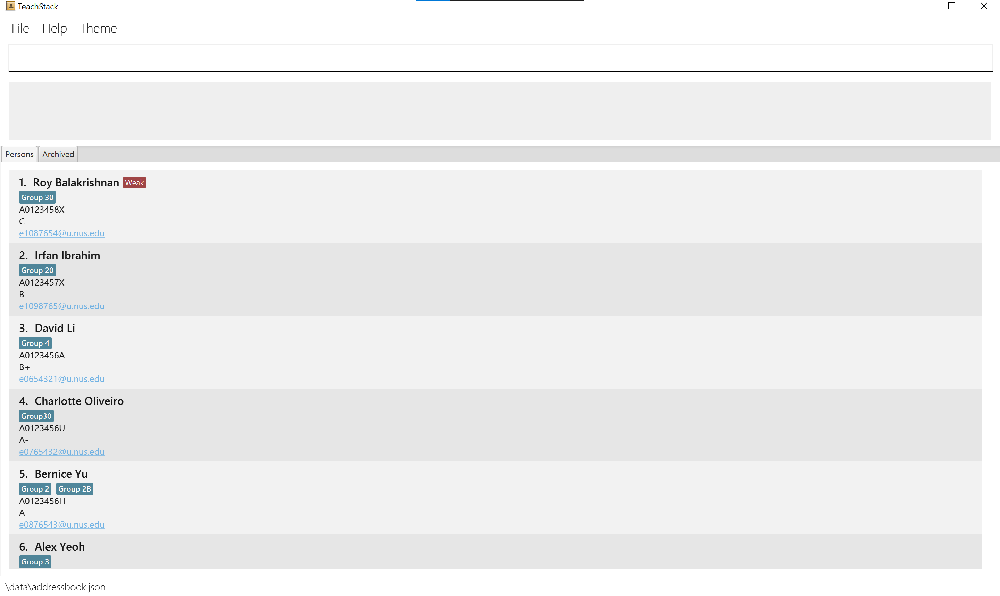

1. Type the command in the command box and press Enter to execute it. e.g. typing **`help`** and pressing Enter will open the help window. 
   Some example commands you can try:

    * `list` : Lists all contacts.
    * `add id/A01234567H n/John Doe e/e0123456@u.nus.edu` : Adds a student named `John Doe` to the list.
    * `delete A0123456X` : Deletes the student with student id A0123456X from the list.
    * `clear` : Deletes all students.
    * `exit` : Exits the app.

1. Refer to the [Features](#features) below for details of each command.

## 6.1 Understanding our GUI
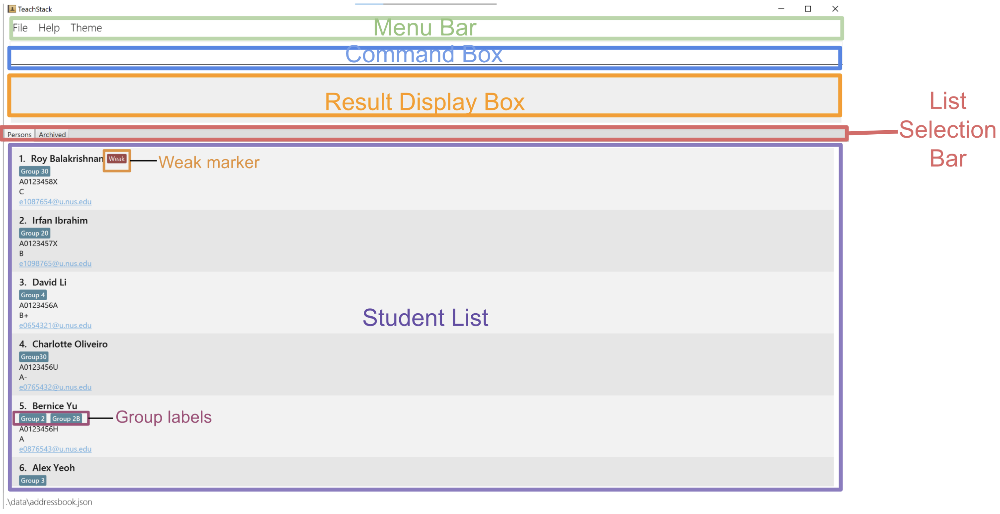
1. Menu Bar: Provides a selection of menu items:
    - File
      - Exit: Allows you to close the application.
    - Help
      - Help: Shows a message on how to access the help page.
    - Theme
      - Dark: Switches the application theme to a dark mode for better visibility in dark environments.
      - Light: Switches the application theme to a light mode for better visibility in bright environments. Theme is set to light mode by default.
2. Command Box: Type in commands to be executed here.
3. Result Display Box: Displays commands' results and any errors.
4. List Selection Bar: Provides a selection of student lists to view:
    - Persons: Displays active student list.
    - Archived: Displays archived student list.
5. Student List: Lists students and their details.
6. Weak marker: Indicates a weaker student.
7. Group labels: Indicates the groups in which a student belongs to.

--------------------------------------------------------------------------------------------------------------------
## Features

**:information_source: Notes about the command format:** 

* Words in `UPPER_CASE` are the parameters to be supplied by the user. 
  e.g. in `add n/NAME`, `NAME` is a parameter which can be used as `add n/John Doe`.

* Items in square brackets are optional. 
  e.g. `n/NAME [gp/GROUP]` can be used as `n/John Doe gp/Group 1` or as `n/John Doe`.

* Ellipsis after a parameter indicates that the command can take in multiple values for the  parameter. 
  e.g. `id/STUDENT_ID…` can be used as `id/A0123434A id/A0232356C` or as `id/A0123434A`.

* Parameters must be in specified order. 

* Extraneous parameters for commands that do not take in parameters (such as `help`, `list`, `exit` and `clear`) will be ignored. 
  e.g. if the command specifies `help 123`, it will be interpreted as `help`.

* Extraneous parameters for commands that do take in parameters (such as `delete` and  `group`) will be ignored. 
  e.g. command `delete A0123432A n/John` or `group gp/Group 3 id/A0123212A id/A4938274F n/John` is invalid.

* If you are using a PDF version of this document, be careful when copying and pasting commands that span multiple lines as space characters surrounding line-breaks may be omitted when copied over to the application.

### 7.1 Viewing help : `help`

Shows a message explaning how to access the help page.

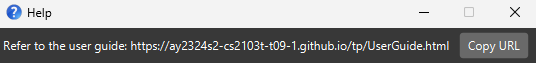

Format: `help`

### 7.2 Adding a student: `add`

Adds student details to the person list.

Format: `add id/STUDENT_ID n/NAME e/EMAIL g/GRADE [gp/GROUP_NAME]​`

* `NAME`, `STUDENT_ID`, `GRADE`, and `EMAIL` must have, `GROUP_NAME` is optional.
* `NAME` is case-sensitive. 
    * e.g. `John Doe is different from john doe`
* `Student_ID` should **start with A follow by 7 digits and ends with a letter [A-Z]**.
    * e.g. `A0123459X`
* `EMAIL` should be of the format **local-part@domain**. The local-part should only be in the **format of e/E follow by 7 digits from [0-9]**. The **domain name must end with a domain label u.nus.edu**.
    * e.g. `e0123456@u.nus.edu`
* `GRADE` should be one of the valid grades: **[A+, A, A-, B+, B, B-, C+, C, D+, D, F]**.

Example:
* `add id/A0123459X n/John Doe e/e0123456@u.nus.edu g/A` adds the person named John Doe with student_id "A0123459X", email "e0123456@u.nus.edu" and grade "A" to the list.

Expected output:
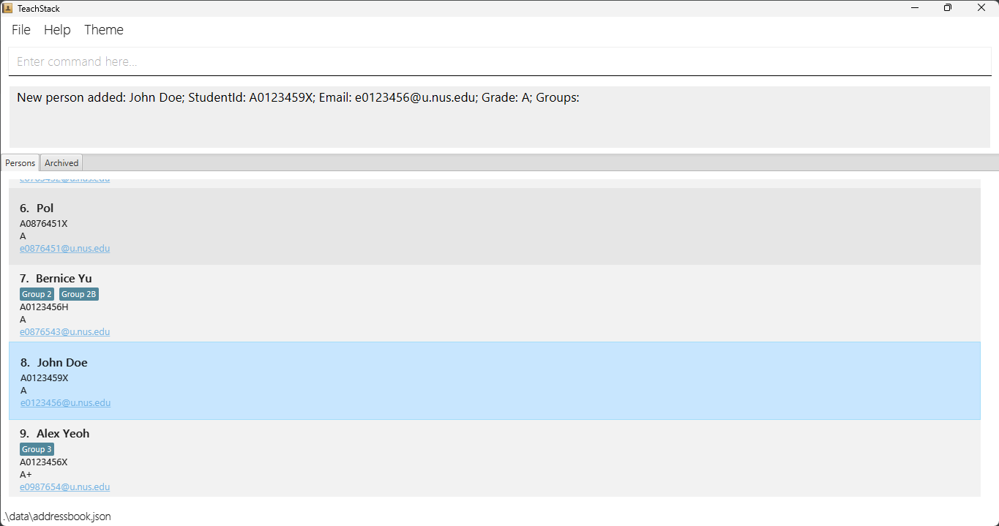

### 7.3 Listing all students: `list`

Shows a list of all students, ordered by grades.

Format: list

### 7.4 Editing a person : `edit`

Edits an existing person in the list of students.

Format: `edit [id/STUDENT_ID] [e/EMAIL] `

* Edits the person with the specified `STUDENT_ID`. The STUDENT_ID refers to the unique alphanumeric sequence assigned to a person shown in the displayed person list. The student_id **must be 9 digits long
* Only 1 field may be provided.
* Existing value will be updated to the input value.
* Name can be case-insensitive, eg. john doe, JOHN DOE same as John Doe
* Email must have the correct domain (@u.nus.edu) and string length of 8 for the email username eg. e0000000@u.nus.edu
* Grade may be of values:  [A+, A, A-, B+, B, B-, C+, C, D+, D, F]

Examples:
*  `edit id/A0123456X e/johndoe@example.com` Edits the email address of the person with student_id = A0123456X to be `e1234567@u.nus.edu`.
*  `edit id/A2233445X n/Betsy Crower` Edits the name of the person with student_id = A2233445X to be `Betsy Crower`.

### 7.5 Viewing students by name: `view`

Shows the detailed information of the student with the specified student_id.

Format: `view STUDENT_ID`

* Returns the detailed information of the student with the corresponding `STUDENT_ID`.
* The `STUDENT_ID` is case-insensitive.
* The `STUDENT_ID` starts with A and ends with a letter and it must be 9 characters long.

Examples:
* `view A0123456X` Shows the detailed information of the student with `STUDENT_ID = A0123456X`

### 7.6 Deleting a person : `delete`

Deletes the specified student from the list.

Format: `delete STUDENT_ID`

* Deletes the person at the specified `STUDENT_ID`.
* The `STUDENT_ID` refers to the id corresponding to the student in the list.
* The `STUDENT_ID` is case-insensitive, must be a String starting with ‘A’ and ending with any letter, with a total length of 9

Examples:
* `delete A0123456X` deletes the student with student id  A0123456X from the list.

### 7.7 Forming focus groups 

#### 7.7.1 Forming focus groups manually: `group`
Creates a group with people corresponding to the selected IDs. 

Format: `group gp/GROUP_NAME id/STUDENTID` (multiple groups, IDs allowed)

* Forms a group with the specified `GROUP_NAME`.
* The group name includes students with the corresponding `STUDENT_IDs`.
* If any of the given `STUDENT_IDs` do not exist, the command completely fails. 
* `GROUP_NAME` cannot be empty, and must only contain alphanumeric characters and space.
* *Giving no parameter for `GROUP_NAME` will clear the given students' current groups!*

Examples: 
* `group gp/3 id/A0123456X id/A0123456H` forms a group called `3` with 2 students in it. 
* `group id/A0123456X id/A0123456H` removes the corresponding 2 students from any groups they are currently in. 

#### 7.7.2 Forming random groups: `random`
Puts all students marked as weak into the specified number of groups.

Format: `random NUMBER_OF_GROUPS gp/GROUP_NAME`

* Form groups `NUMBER_OF_GROUPS` with the specified `GROUP_NAME` followed by numbering.
* The `NUMBER_OF_GROUPS` refers to the number of groups to distribute students into.
* `NUMBER_OF_GROUPS` must be a positive integer that is greater than the number of students marked as weak.
* `GROUP_NAME` cannot be empty, and must only contain alphanumeric characters and space.

Examples:
* `random 3 gp/Random Group` randomly distributes all weaker students into 3 groups: Random Group 1, Random Group 2, Random Group 3.

### 7.8 Filtering students by groups: `find`
Updates the list to display only students that are in the group(s) specified.

Format: `find gp/GROUP_NAME [gp/GROUP_NAME]`

* At least one `GROUP_NAME` must be specified. Otherwise, the command will fail.
* If multiple `GROUP_NAME`s are specified, only students who are in all groups entered will be displayed.
* `GROUP_NAME` cannot be empty, and must only contain alphanumeric characters and space.

Examples:
* `find gp/Group 1` will update the list to display all students assigned to Group 1.
* `find gp/Group 1 gp/Group 2` will update the list to display all students assigned to both Group 1 and Group 2.

### 7.9 Clearing all entries : `clear`

Clears all entries from the list of students.

Format: `clear`

### 7.9 Archiving Features
#### 7.9.1 Archiving a student : `archive`

Archives a student from the person list to the archived list.

Format: `archive STUDENT_ID`

* Archives a student with the specified `STUDENT_ID`.
* `Student_ID` should **start with A follow by 7 digits and ends with a letter [A-Z]**.
    * e.g. `A0123459X`
* The student with the specified `STUDENT_ID` must exists in the person list.

Example:
* `archive A0123459X` archives a student with the student_id "A0123459X".

Expected output:
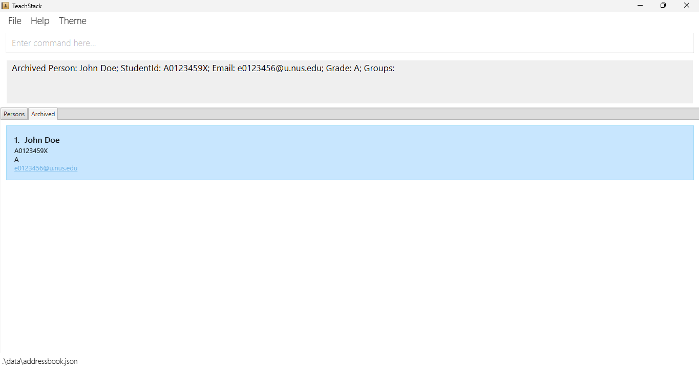

#### 7.9.2 Editing an archived student : `edit_archived`

Edits details of an archived student.

Format: `edit_archived STUDENT_ID [id/STUDENT_ID] [n/NAME] [e/EMAIL] [g/GRADE] [gp/GROUP_NAME]...`

* Edits the details of an archived student with the specified `STUDENT_ID`.
* At least one of the optional fields indicated within the square bracket must be provided.
* The `...` after the `GROUP_NAME` indicates that multiple `GROUP_NAME` can be provided for editing.
* The student with the specified `STUDENT_ID` must exists in the archived list.

Examples:
* `edit_archived A0123459X g/B e/e0237861@u.nus.edu` edits the grade of the student with student_id "A0123459X" to "B" and the email to "e0237861@u.nus.edu".

Expected output:
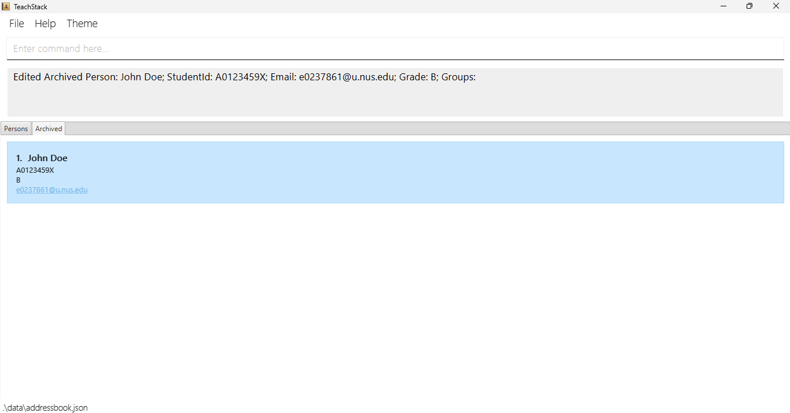

#### 7.9.3 Deleting an archived student : `delete_archived`

Deletes an archived student from the archived list.

Format: `delete_archived STUDENT_ID`

* Deletes an archived student with the specified `STUDENT_ID`.
* `Student_ID` should **start with A follow by 7 digits and ends with a letter [A-Z]**.
    * e.g. `A0123459X`
* The student with the specified `STUDENT_ID` must exists in the archived list.

Example: 
* `delete_archived A0123459X` deletes the student with student_id "A0123459X" from the archived list.

Expected output:
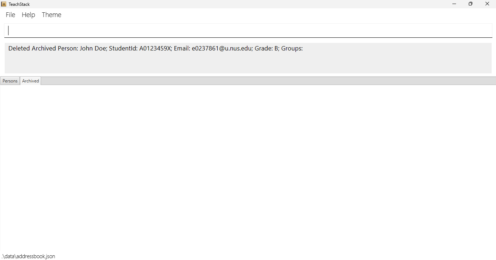

#### 7.9.4 Unarchiving a student : `unarchived`

Unarchives a student from the archived list to the person list.

Format: `unarchived STUDENT_ID`

* Unarchives a student with the specified `STUDENT_ID`.
* `Student_ID` should **start with A follow by 7 digits and ends with a letter [A-Z]**.
    * e.g. `A0123459X`
* The student with the specified `STUDENT_ID` must exists in the archived list.

Examples:
* `unarchived A0123459X` unarchives a student with the student_id "A0123459X".

Expected output:
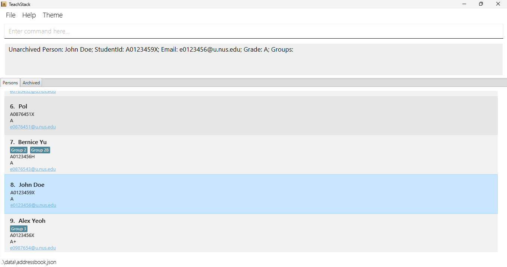

#### 7.9.5 Clearing all entries : `clear_archived`

Clears all entries from the archived list.

Format: `clear_archived`

### 7.10 Exiting the program : `exit`

Exits the program.

Format: `exit`

### 7.11 Saving the data

TeachStack data is saved in the hard disk automatically after any command that changes the data. There is no need to save manually.

### 7.12 Editing the data file

TeachStack data is saved automatically as a JSON file `[JAR file location]/data/addressbook.json`. Advanced users are welcome to update data directly by editing that data file.

:exclamation: **Caution:**
If your changes to the data file makes its format invalid, TeachStack will discard all data and start with an empty data file at the next run. Hence, it is recommended to take a backup of the file before editing it. 
Furthermore, certain edits can cause the TeachStack to behave in unexpected ways (e.g., if a value entered is outside of the acceptable range). Therefore, edit the data file only if you are confident that you can update it correctly.

### 7.14 Setting weak threshold

Sets the weakness threshold for a weak marker.

Format: `setweak [g/GRADE]`

* By default, weakness threshold is set at Grade: C+
* Updates weakness threshold value
* Students with grade lower or equal to threshold grade appear with a marker in the UI
* `GRADE` should be one of the valid grades: **[A+, A, A-, B+, B, B-, C+, C, D+, D, F]**.

Example: 
* `setweak B` displays a weak marker for all students with grade B or lower.

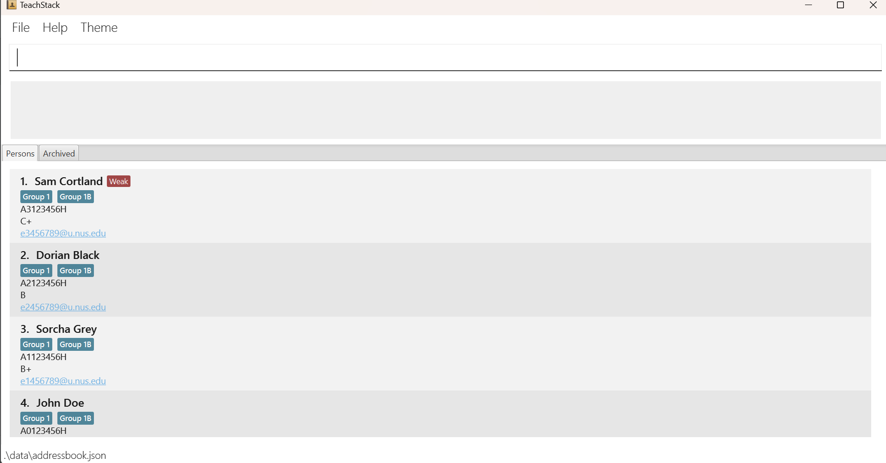

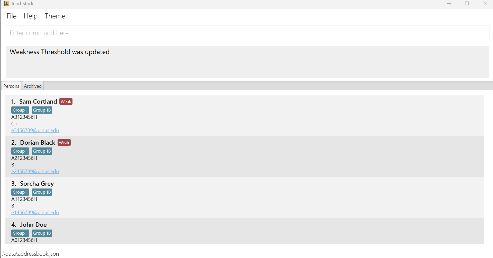

### 7.15 Viewing summary statistics

Displays a summary of all students.

Format: `summary`

* Entering command opens a popup.
* Popup contains statistics: Total Students, Average Grade, and Standard Deviation of Grades.
* Popup contains pie chart of students' grades.

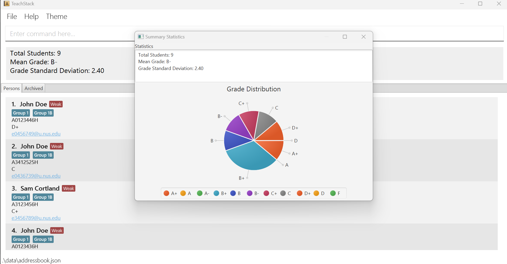

--------------------------------------------------------------------------------------------------------------------

## FAQ

**Q**: How do I transfer my data to another Computer? 
**A**: Install the app in the other computer and overwrite the empty data file it creates with the file that contains the data of your previous TeachStack home folder.

--------------------------------------------------------------------------------------------------------------------

## Known issues

1. **When using multiple screens**, if you move the application to a secondary screen, and later switch to using only the primary screen, the GUI will open off-screen. The remedy is to delete the `preferences.json` file created by the application before running the application again.

--------------------------------------------------------------------------------------------------------------------

## Command summary

| Action      | Format, Examples                                                                                                         |
|-------------|--------------------------------------------------------------------------------------------------------------------------|
| **Add**     | `add id/STUDENT_ID n/NAME e/EMAIL g/GRADE [t/TAG]​​`   e.g., `add id/A01234567X n/James Ho e/e0123456@u.nus.edu g/B+` |
| **Delete**  | `delete id/STUDENT_ID`  e.g., `delete A01234567X`                                                                     |
| **Edit**    | `edit id/STUDENT_ID [g/GRADE] `  e.g.,`edit A0123466C g/A+`                                                           |
| **View**    | `view id/STUDENT_ID`  e.g., `view A0123466D`                                                                          |
| **Group**   | `group id/STUDENT_ID_1 [id/STUDENT_ID_2] …`   e.g., `group A1234567R, A2345678R`                                      |
| **Weak**    | `setweak g/GRADE`   e.g., `setweak g/B-`                                                                              |
| **Summary** | e.g., `summary`                                                                                                       |